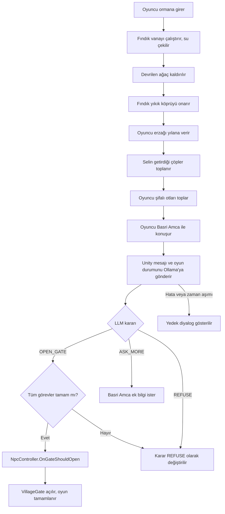

# Küçük Otacı

## Ekip

- Meryem
- Hatice

## Proje Amacı

Küçük Otacı, Unity ve C# ile geliştirilen 3D bir macera oyunudur. Proje, aynı oyun içinde iki bağımsız yapay zeka bileşenini birleştirmeyi amaçlar:

- **Fındık:** NavMesh ve Raycast kullanan otonom yardımcı karakter
- **Basri Amca:** Ollama üzerinde yerel olarak çalışan büyük dil modeli (LLM) destekli NPC

## Oyun Senaryosu

Oyuncu, Hasat Şenliği için şifalı ot toplamak üzere ormana girer. Şiddetli yağmur ve sel nedeniyle yol su altında kalmıştır; ayrıca selin getirdiği büyük bir ağaç yolun üzerine devrilmiştir. Oyuncu bu fiziksel engelleri tek başına aşamaz.

Oyuncunun otonom yardımcısı Fındık, oyuncunun komutuyla NavMesh kullanarak vana koluna ulaşır. Raycast sensörleriyle çevresini algılar, yolu takip eder ve vana ile etkileşime geçerek suyun çekilmesini sağlar. Su çekildikten sonra Fındık devrilen ağacın kaldırılmasına yardımcı olur ve oyuncunun ormanda ilerleyebileceği yolu açar.

Yolun devamında oyuncu ve Fındık yıkık bir köprüyle karşılaşır. Oyuncu köprüden tek başına geçemez; Fındık köprüye ulaşıp onarım etkileşimini gerçekleştirerek köprüyü onarır.

Daha sonra yolda bir yılanla karşılaşırlar. Oyuncu, evden çıkarken yol için yanına aldığı erzağı yılana verir. Yılan erzakla yetinir ve yolu açar; böylece ikili tehlikeden kurtulur.

Yolun son bölümünde selin getirdiği çöpler patikayı kapatmıştır. Oyuncu ve Fındık bu çöpleri toplar ve yola devam eder.

Oyuncu şifalı otları toplayarak köy kapısına ulaşır. Köyün bekçisi Basri Amca ile hazır seçenekler yerine serbest metin kullanarak konuşur. Basri Amca'nın Ollama üzerinde çalışan yerel LLM tarafından üretilen yapılandırılmış yanıtı, oyuncunun açıklamasını ve Unity'nin gönderdiği gerçek oyun durumunu değerlendirir.

**Köprü onarılmamışsa, yılan olayı çözülmemişse veya çöpler toplanmamışsa Basri Amca kapıyı açmaz.** Oyuncu ne kadar ikna edici yazarsa yazsın bu üç görev tamamlanmadan kapı açılmaz. Görevler tamamlandığında yanıt sonucunda kapı açılır, Basri Amca ek soru sorar veya oyuncuyu geçici olarak reddeder.

## Görev Sistemi

Oyuncu ve Fındık köy kapısına varmadan önce üç görevi tamamlamak zorundadır. Görevlerin durumu Unity tarafında `QuestManager` ile tutulur.

| # | Görev | Nasıl çözülür | Görev kimliği |
|---|-------|---------------|---------------|
| 1 | Yıkık köprü | Fındık köprüye gider ve onarım etkileşimini yapar | `BridgeRepaired` |
| 2 | Yılan | Oyuncu, evden çıkarken aldığı erzağı yılana verir | `SnakeResolved` |
| 3 | Sel çöpleri | Oyuncu ve Fındık, selin getirdiği çöpleri toplar | `DebrisCleared` |

Vana ve devrilen ağaç görevleri (`waterDrained`, `treeCleared`) yolu fiziksel olarak açan ön adımlardır; bunlar tamamlanmadan yukarıdaki görevlere ulaşılamaz.

## Yapay Zeka Bileşenleri

### Fındık - Otonom Companion

Fındık, oyuncunun yanında bekleyen otonom yardımcı karakterdir. Oyuncunun komutu üzerine NavMesh kullanarak vana koluna ve yıkık köprüye ulaşır, ilgili etkileşimleri gerçekleştirir. Raycast sensörleriyle çevresindeki engelleri algılar. Fiziksel engeller kaldırıldıktan sonra oyuncunun ilerlemesine yardım eder.

Fındık'ın davranışı önceden belirlenmiş hareket adımlarına dayanmaz. Hedefe ulaşmak için NavMesh üzerinde yol bulur ve durum makinesi ile aşağıdaki durumları yönetir:

- Bekleme (Idle)
- Komut alma
- Hedefe ilerleme (MovingToTarget)
- Engel algılama
- Etkileşim (Interacting)
- Oyuncuya dönme (ReturningToPlayer)

### Basri Amca - Yerel LLM Destekli NPC

Basri Amca, köy kapısını koruyan şüpheci fakat iyi niyetli bir bekçidir. Oyuncu Basri Amca ile hazır cevap seçenekleri yerine serbest metin aracılığıyla konuşur.

Basri Amca'nın yanıtları, Ollama üzerinde yerel olarak çalışan büyük dil modeli tarafından üretilir. Modelin yanıtı `dialogue`, `decision` ve `mood` alanlarını içeren JSON formatındadır. Unity, JSON yanıtını doğrular ve yalnız geçerli kararları oyun durumuna uygular.

Oyuncunun topladığı otlar ve görevlerin durumu gibi bilgiler Unity tarafından tutulur. Bu bilgiler LLM'ye bağlam olarak iletilir; LLM'nin oyun durumunu tahmin etmesine izin verilmez.

## Temel Oyun Akışı

1. Oyuncu ormana girer.
2. Sel nedeniyle su altında kalan ve devrilen ağaçla kapanan yola ulaşır.
3. Oyuncu Fındık'a komut verir.
4. Fındık NavMesh ve Raycast kullanarak vana koluna ulaşır.
5. Vana çalışır, su çekilir ve Fındık yol üzerindeki devrilen ağacın kaldırılmasına yardım eder.
6. Oyuncu ve Fındık yıkık köprüye ulaşır; Fındık köprüyü onarır.
7. Yolda yılanla karşılaşırlar; oyuncu evden çıkarken aldığı erzağı yılana verir ve yılan yolu açar.
8. Selin getirdiği çöpler toplanır ve yola devam edilir.
9. Oyuncu şifalı otları toplar ve köy kapısına ulaşır.
10. Oyuncu Basri Amca ile serbest metin aracılığıyla konuşur.
11. Unity, oyuncu mesajını ve gerçek oyun durumunu (görev durumları dahil) Ollama'ya gönderir.
12. Ollama, `dialogue`, `decision` ve `mood` içeren JSON yanıtı üretir.
13. Unity yanıtı doğrular. Görevler tamamlanmamışsa `OPEN_GATE` kararını `REFUSE` olarak değiştirir.
14. Unity geçerli yanıta göre kapıyı açar, ek konuşma başlatır veya geçici ret durumunu uygular.
15. Kapı açılırsa oyuncu Hasat Şenliği alanına ulaşır ve oyun tamamlanır.

## Oyun Durumu ve Kararların Doğrulanması

Oyunun önemli durumları Unity tarafından tutulur. Bu sayede yerel LLM, oyuncunun oyun içindeki davranışlarını tahmin etmek yerine gerçek oyun verilerini bağlam olarak alır.

Örnek oyun durumları:

- `waterDrained`: Vana etkinleştirilip suyun çekilip çekilmediği
- `treeCleared`: Devrilen ağacın kaldırılıp kaldırılmadığı
- `bridgeRepaired`: Fındık'ın yıkık köprüyü onarıp onarmadığı
- `snakeResolved`: Oyuncunun erzağı yılana verip yolu açıp açmadığı
- `debrisCleared`: Selin getirdiği çöplerin toplanıp toplanmadığı
- `collectedHerbs`: Oyuncunun topladığı şifalı otlar

Basri Amca'nın yerel LLM tarafından üretilen yanıtı, `dialogue`, `decision` ve `mood` alanlarını içerir. Unity yalnızca izin verilen kararları kabul eder:

- `OPEN_GATE`: Köy kapısı açılır.
- `ASK_MORE`: Basri Amca ek bilgi ister ve diyalog devam eder.
- `REFUSE`: Basri Amca oyuncuyla geçici olarak konuşmayı reddeder.

Beklenmeyen kararlar, boş yanıtlar veya geçersiz JSON verileri oyun durumunu değiştirmez. Bu durumlarda kullanıcıya anlamlı bir hata mesajı gösterilir ve oyun çalışmaya devam eder.

### Kapı Karar Mekanizması

Kapıyı açma kararı iki katmanlıdır:

1. **LLM katmanı:** Basri Amca, oyuncunun mesajını ve Unity'nin ilettiği görev durumunu alır; `OPEN_GATE`, `ASK_MORE` veya `REFUSE` kararını JSON olarak döndürür.
2. **Kural katmanı:** Köprü, yılan ve çöp görevlerinin tamamı bitmediyse, LLM `OPEN_GATE` dese bile Unity kararı `REFUSE` olarak değiştirir. Böylece sonuç, modelin hata yapmasından bağımsız ve deterministiktir.

Oyuncu kapıyı doğrudan açamaz. `VillageGate`, yalnızca `NpcController.OnGateShouldOpen` olayını dinler; bu olay da yalnızca doğrulanmış `OPEN_GATE` kararından sonra tetiklenir.

LLM isteği `OllamaClient` içinde 30 saniyelik zaman aşımıyla çalışır. İstek sürerken arayüzde "Basri Amca düşünüyor..." metni gösterilir; cevap veya hata geldiğinde metin kapanır.

## Kullanılan Teknolojiler

- Unity
- C#
- NavMesh
- Raycast
- Ollama (gemma2:2b)
- Yerel LLM
- Git ve GitHub
- Markdown ve Mermaid